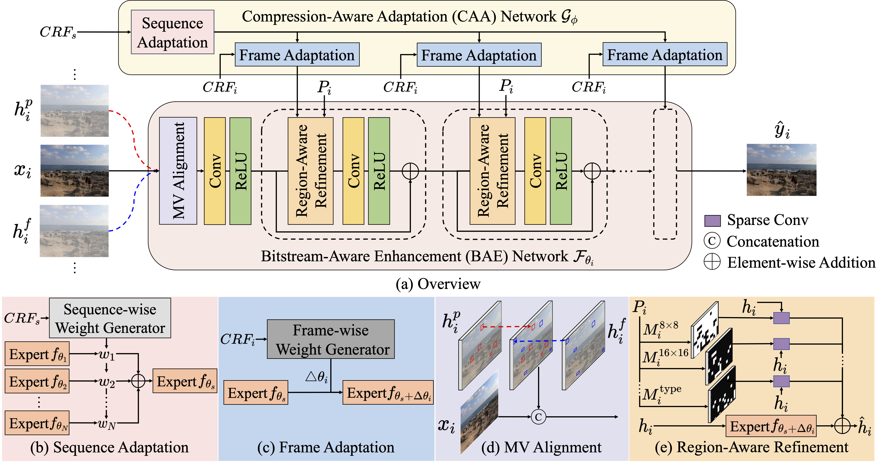

# Plug-and-Play Versatile Compressed Video Enhancement
<a href="https://openaccess.thecvf.com/content/CVPR2025/papers/Zeng_Plug-and-Play_Versatile_Compressed_Video_Enhancement_CVPR_2025_paper.pdf"></a> 
<a href="https://openaccess.thecvf.com/content/CVPR2025/supplemental/Zeng_Plug-and-Play_Versatile_Compressed_CVPR_2025_supplemental.pdf"></a> 
<a href="https://arxiv.org/abs/2504.15380"></a> 
<a href="https://www.youtube.com/watch?v=ZmsexIBM3ao&t=6s"></a>
<a href="https://huimin-zeng.github.io/PnP-VCVE/"></a>


[Huimin Zeng](https://zeldam1.github.io/), [Jiacheng Li](http://home.ustc.edu.cn/~jclee/), [Zhiwei Xiong](http://staff.ustc.edu.cn/~zwxiong/)


## 🔥 Update
🔥 2025/6/5: We release [code](https://github.com/ZeldaM1/PnP-VCVE) and [checkpoint](https://drive.google.com/drive/folders/1__w21sSiEeKGCN_Rhzesii8trCdgVdxC?usp=sharing) for this project.

2025/4/10: Our Plug-and-Play was accepted to CVPR 2025


## Introduction
Video compression effectively reduces the size of files, making it possible for real-time cloud computing, while **it comes at the cost of visual quality**, posing challenges to the robustness of downstream vision models. In this work, we present a versatile codec-aware enhancement framework that reuses codec information to adaptively enhance videos under different compression settings, assisting various downstream vision tasks without introducing computation bottleneck.  Extensive experimental results demonstrate the **superior quality enhancement performance** of our framework over existing enhancement methods, as well as its **versatility in assisting multiple downstream tasks** on compressed videos as a plug-and-play module.
  
## Overview
The proposed codec-aware framework consists of a compression-aware adaptation (CAA) network that employs a hierarchical adaptation mechanism to estimate parameters of the frame-wise enhancement network, namely the bitstream-aware enhancement (BAE) network. The BAE network further leverages temporal and spatial priors embedded in the bitstream to effectively improve the quality of compressed input frames. 


## Dataset

| Task        | Dataset   |  
|----------------|---------------|
| Quality Enhancement        | [REDS](https://seungjunnah.github.io/Datasets/reds.html)         |  
| Video Super-Resolution|  [REDS](https://seungjunnah.github.io/Datasets/reds.html)   |
| Optical Flow Estimation|  [KITTI](https://www.cvlibs.net/datasets/kitti/eval_flow.php) |
| Video Object Segmentation|  [DAVIS](https://davischallenge.org/davis2017/code.html) |
| Video Inpainting|  [DAVIS](https://davischallenge.org/davis2017/code.html) |


* The adopted official datasets can be found above, we provide compressed dataset on [GoogleDrive](https://drive.google.com/drive/folders/1MlPY6fYFBcljFlslIqkbQd-Ea2_0GkLp?usp=sharing).
* Download all the datasets and structure the data as follows:

```
dataset
├── davis_all
├── KITTI
├── REDS_test_HR
├── REDS_test_LR
│   ├── crf15
│   │   ├── mv
│   │   ├── png
│   │   └── video_qp
│   ├── crf25
│   ├── crf35
│   ├── REDS_test_LR.json
│   └── X4
```


## Environment 
We provide  docker image to prepare the running enviroment, which can be obtained using the following command: 
```
docker pull registry.cn-hangzhou.aliyuncs.com/zenghuimin/zhm_docker:py37-torch18
```
## Train 
* CRF based adaptation
```
./tools/dist_train.sh  configs/HR_davis_LR_128x128.py  1   --exp_name HR_davis_LR_128x128
```
* Replacing CRF with slice type (adopted for assisting in downstream tasks)
```
./tools/dist_train.sh  configs/HR_davis_LR_128x128_IPB.py  1   --exp_name HR_davis_LR_128x128_IPB
```
## Test
We provide checkpoint on [GoogleDrive](https://drive.google.com/drive/folders/1__w21sSiEeKGCN_Rhzesii8trCdgVdxC?usp=sharing). Please download and put it at `./checkpoint`, structured as follows:
```
checkpoint
├── HR_davis_LR_128x128_IPB.pth
└── HR_davis_LR_128x128.pth
```
### Quality enhancement (REDS4 Dataset)
```
./tools/dist_test.sh  configs/HR_davis_LR_128x128.py   checkpoint/HR_davis_LR_128x128.pth   1   \
--testdir_lr  dataset/REDS_test_HR/crf15/png    --testdir_gt dataset/REDS_test_HR/sharp/png   --save-path ./HR_davis_LR_128x128/REDS_test_HR/crf15
 
./tools/dist_test.sh  configs/HR_davis_LR_128x128_IPB.py checkpoint/HR_davis_LR_128x128_IPB.pth  1   \
--testdir_lr  dataset/REDS_test_HR/crf15/png    --testdir_gt dataset/REDS_test_HR/sharp/png --save-path ./HR_davis_LR_128x128_IPB/REDS_test_HR/crf15
```
### Downstream tasks 
* Video super-resolution (LR REDS4 Dataset)
```
 ./tools/dist_test.sh  configs/HR_davis_LR_128x128_IPB_LR_test.py checkpoint/HR_davis_LR_128x128_IPB.pth  1   \
 --testdir_lr  dataset/REDS_test_LR/crf15/png    --testdir_gt dataset/REDS_test_LR/X4/png --save-path ./HR_davis_LR_128x128_IPB/REDS_test_LR/crf15
```
Downstream video super-resolution models can be found at [BasicVSR](https://github.com/open-mmlab/mmagic/blob/main/configs/basicvsr_pp/README.md), [IconVSR](https://github.com/open-mmlab/mmagic/blob/main/configs/basicvsr/README.md) and [BasicVSR++](https://github.com/open-mmlab/mmagic/blob/main/configs/iconvsr/README.md).

* Optical flow estimation (KITTI Dataset)
```
 ./tools/dist_test.sh  configs/HR_davis_LR_128x128_IPB_LR_test.py checkpoint/HR_davis_LR_128x128_IPB.pth  1   \
 --testdir_lr  dataset/KITTI/crf15/png    --testdir_gt dataset/KITTI/X4/png --save-path ./HR_davis_LR_128x128_IPB/KITTI/crf15
```
Downstream optical flow estimation models can be found at [RAFT](https://github.com/princeton-vl/RAFT), [DEQ](https://github.com/locuslab/deq-flow) and [KPAFlow](https://github.com/megvii-research/KPAFlow).

* Video object segmentation & video inpainting (DAVIS Dataset)
```
 ./tools/dist_test.sh  configs/HR_davis_LR_128x128_IPB_LR_test.py checkpoint/HR_davis_LR_128x128_IPB.pth  1   \
 --testdir_lr  dataset/davis_all/crf15/png    --testdir_gt dataset/davis_all/X4/png --save-path ./HR_davis_LR_128x128_IPB/davis_all/crf15
```
Downstream video object segmentation models can be found at [STCN](https://github.com/hkchengrex/STCN), [DeAoT](https://github.com/z-x-yang/AOT?tab=readme-ov-file) and [QDMN](https://github.com/yongliu20/QDMN). Video inpainting model can be found at [E2FGVI](https://github.com/MCG-NKU/E2FGVI).

## TODO
* config file for KITTI/DAVIS dataset

## Acknowledgement
This repository is partly built on [MMEditing](https://github.com/open-mmlab/mmagic). We appreciate their authors for creating these brilliant works and sharing codes with the community.

## Citation
If you find our Plug-and-Play useful, please star ⭐ this repository and consider citing:
```bibtex
@article{zeng2025plug,
  title={Plug-and-Play Versatile Compressed Video Enhancement},
  author={Zeng, Huimin and Li, Jiacheng and Xiong, Zhiwei},
  journal={arXiv preprint arXiv:2504.15380},
  year={2025}
}
```
